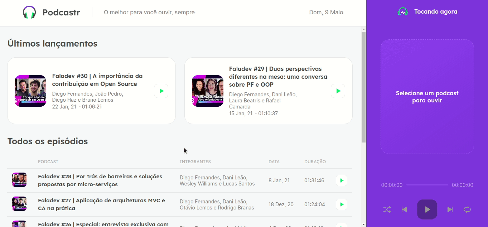

<h1 align="center">
  
</h1>

<p align="center">
  <a href="#-tecnologias">Tecnologias</a>&nbsp;&nbsp;&nbsp;|&nbsp;&nbsp;&nbsp;
  <a href="#-projeto">Projeto</a>
</p>


<br>

<p align="center">
  
</p>


## 🚀 Tecnologias

Tecnologias utilizadas:

- ReactJS
- Typescript
- NextJS
- SASS

## 💻 Projeto

<p><strong>Podcastr</strong> é uma aplicação construída durante a NLW 5, promovida pela Rocketseat. A app oferece uma lista de podcasts ao usuário, o qual pode ver detalhes sobre o mesmo e ouvi-lo. 
Além disso, foi usado Server Side Rendering e Static Site Generation, duas features do Next que nos permitem, entre outras coisas, ter uma velocidade maior no carregamento da app e consequentemente uma melhor experiência do usuário.</p>

---

#### 🛠️ Instale o projeto na sua máquina:

```bash

    # Clonar o repositório
    $ git clone https://github.com/marcoskloss/podcastr.git

    # Entrar no diretório
    $ cd podcastr

    # Instalando as dependencias com Yarn
    $ yarn install
    
    # Rodando a api fake para servir a lista de podcasts
    $ yarn server
    
    # Executando a aplicação
    $ yarn dev
```
